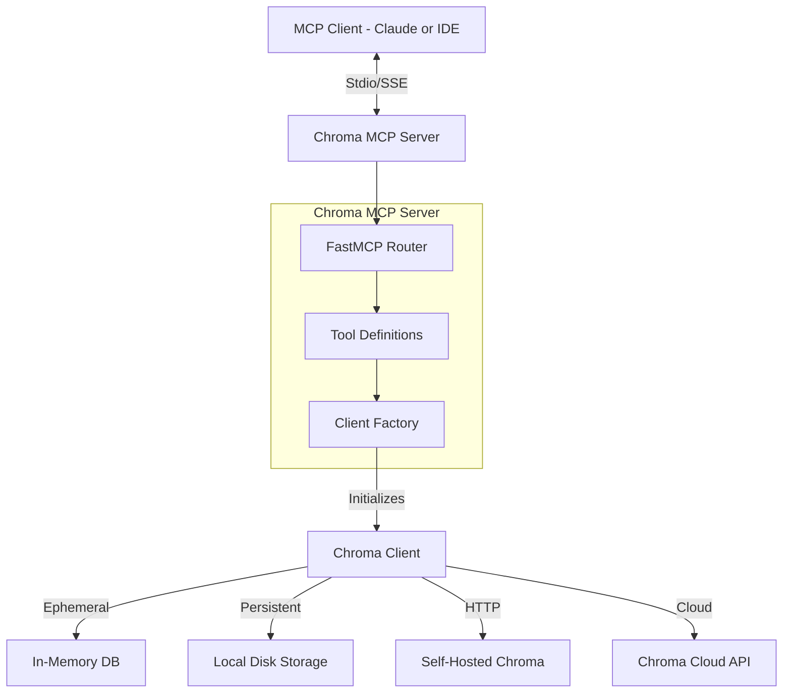

# System Architecture

## Overview
The Chroma MCP Server is a Python-based application that implements the Model Context Protocol to expose Chroma vector database functionalities as tools. It acts as an intermediary between MCP clients (like Claude or IDEs) and a Chroma instance (local or remote).

## Architecture Diagram

## Source Code Structure
- **`src/chroma_mcp/server.py`**: The core entry point and implementation file.
    - **Initialization**: Parses command-line arguments to configure the Chroma client.
    - **Global State**: Maintains a global `_chroma_client` instance.
    - **Tool Definitions**: Decorates functions with `@mcp.tool()` to expose them as MCP tools.
        - `chroma_list_collections`
        - `chroma_create_collection`
        - `chroma_add_documents`
        - `chroma_query_documents`
        - ... and others.
- **`pyproject.toml`**: Defines project dependencies, metadata, and build configuration.

## Key Design Decisions
- **Single Global Client**: The server uses a global `_chroma_client` variable, initialized lazily or at startup. This ensures connection reuse but requires careful handling of configuration updates.
- **Flexible Configuration**: Configuration is handled via a hierarchy of Command Line Arguments > Environment Variables (`.env`) > Defaults.
- **Error Handling**: Tools wrap Chroma calls in `try...except` blocks to return meaningful error messages to the LLM instead of crashing the server.
- **Async Implementation**: Tools are defined as `async def`, leveraging FastMCP's asynchronous capabilities for better responsiveness.

## Data Flow
1. **Request**: MCP Client sends a tool call request (e.g., `call_tool("chroma_query_documents", ...)`).
2. **Routing**: FastMCP routes the request to the corresponding Python function.
3. **Execution**:
    - The function retrieves the global Chroma client.
    - It calls the appropriate Chroma SDK method (e.g., `collection.query()`).
4. **Response**: Results are formatted (usually as JSON/Dict) and returned to the MCP Client.