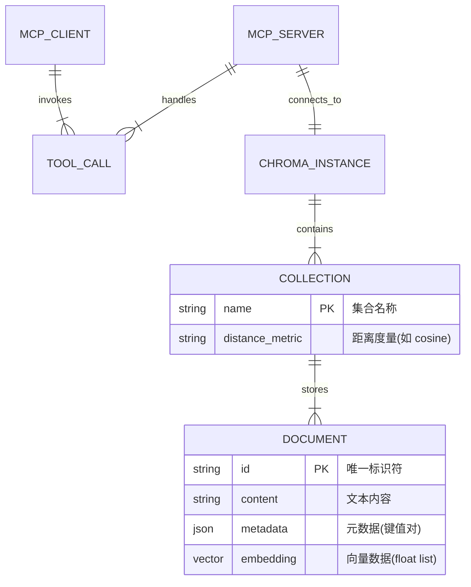

# Chroma MCP Server 设计验收文档

## 1. 概念设计 (Conceptual Design)

### 1.1 系统目标
本项目旨在构建一个符合 **Model Context Protocol (MCP)** 标准的服务器应用，作为大型语言模型 (LLM) 与 **Chroma 向量数据库** 之间的连接桥梁。其核心目的是赋予 LLM 以下能力：
*   **长期记忆 (Long-term Memory)**: 持久化存储对话内容或知识片段。
*   **语义检索 (Semantic Search)**: 基于向量相似度快速检索相关信息，支持 RAG (检索增强生成) 场景。
*   **知识库管理**: 动态创建、更新和删除向量集合。

### 1.2 核心实体模型 (ER 概念图)

系统围绕以下核心实体构建：



### 1.3 关键用例
1.  **初始化连接**: 根据配置连接到本地或远程 Chroma 实例。
2.  **知识入库**: 用户让 AI "记住" 一段信息 -> 调用 `chroma_add_documents` -> 生成向量并存储。
3.  **信息检索**: 用户提问 -> 调用 `chroma_query_documents` -> 检索最相似文档 -> 返回给 AI 作为上下文。

---

## 2. 逻辑设计 (Logical Design)

### 2.1 系统架构图

系统采用轻量级的分层架构，基于 `mcp` SDK 实现。

```mermaid
graph TD
    subgraph "MCP Client Side"
        Client[Claude / IDE / Agent]
    end

    subgraph "Chroma MCP Server"
        Transport[Transport Layer (Stdio)]
        Router[FastMCP Router]
        
        subgraph "Tool Implementation Layer"
            CollectionMgr[Collection Manager]
            DocOps[Document Operations]
            EmbeddingSvc[Embedding Service]
        end
        
        Factory[Client Factory]
    end

    subgraph "Data Storage Layer"
        ChromaDB[(Chroma Vector DB)]
        EmbeddingAPI[Embedding Provider API]
    end

    Client <-->|JSON-RPC 2.0| Transport
    Transport <--> Router
    Router -->|Dispatch| CollectionMgr
    Router -->|Dispatch| DocOps
    Router -->|Dispatch| EmbeddingSvc
    
    CollectionMgr & DocOps & EmbeddingSvc -->|Use| Factory
    Factory -->|Init| ChromaDB
    EmbeddingSvc -.->|Optional| EmbeddingAPI
```

### 2.2 模块功能定义

#### 2.2.1 客户端工厂 (Client Factory)
负责屏蔽底层连接细节，根据配置动态实例化 Chroma 客户端。
*   **输入**: 环境变量 (`CHROMA_CLIENT_TYPE`, `CHROMA_HOST` 等) 或命令行参数。
*   **输出**: `chromadb.ClientAPI` 实例。
*   **支持模式**:
    *   `ephemeral`: 内存模式 (测试用)。
    *   `persistent`: 本地磁盘模式。
    *   `http`: 远程自托管服务器模式。
    *   `cloud`: Chroma 官方云服务模式。

#### 2.2.2 工具集 (Tool Registry)
暴露给 MCP 客户端的功能接口：
*   **集合工具**: `chroma_list_collections`, `chroma_create_collection`, `chroma_delete_collection` 等。
*   **文档工具**: `chroma_add_documents`, `chroma_query_documents`, `chroma_get_documents`, `chroma_update_documents`, `chroma_delete_documents`。
*   **辅助工具**: `chroma_embed_texts` (仅生成向量不存储)。

#### 2.2.3 嵌入服务 (Embedding Service)
处理文本到向量的转换。
*   **默认**: 使用 Chroma 内置的 ONNX 模型 (all-MiniLM-L6-v2)。
*   **扩展**: 支持配置 OpenAI 等第三方 API 进行向量化。

### 2.3 接口设计 (Interface Design)
所有工具遵循 MCP 协议规范，输入输出均为 JSON 格式。

**示例：`chroma_query_documents`**
*   **输入**:
    ```json
    {
      "collection_name": "my_knowledge",
      "query_texts": ["如何配置 MCP?"],
      "n_results": 5
    }
    ```
*   **输出**: 包含文档内容、元数据和距离分数的结构化数据。

---

## 3. 物理设计 (Physical Design)

### 3.1 目录结构
```text
e:/MCP_tool/chroma-mcp/
├── src/
│   └── chroma_mcp/
│       ├── __init__.py
│       └── server.py       # 核心实现文件 (单文件架构)
├── tests/
│   └── test_server.py      # 自动化测试套件
├── Dockerfile              # 容器化构建描述
├── pyproject.toml          # 项目依赖与元数据 (uv/hatchling)
├── uv.lock                 # 依赖版本锁定
└── .env                    # 环境配置 (不入库)
```

### 3.2 部署架构
系统设计为无状态服务（状态存储在外部 ChromaDB 中），适合容器化部署。

*   **容器镜像**: 基于 `python:3.10-slim` 构建。
*   **运行时**:
    *   使用 `uv` 进行快速依赖安装。
    *   入口点: `chroma-mcp` (映射到 `chroma_mcp.server:main`)。
*   **依赖管理**:
    *   `mcp[cli]`: MCP 协议实现。
    *   `chromadb`: 数据库客户端。
    *   `onnxruntime`: 默认嵌入模型推理引擎。

### 3.3 环境配置 (Configuration)
配置遵循优先级原则：命令行参数 > 环境变量 > 默认值。

| 环境变量 | 作用 | 默认值 |
| :--- | :--- | :--- |
| `CHROMA_CLIENT_TYPE` | 客户端模式 | `ephemeral` |
| `CHROMA_HOST` | HTTP 模式主机地址 | - |
| `CHROMA_PORT` | HTTP 模式端口 | `8000` |
| `CHROMA_DATA_DIR` | 持久化模式数据路径 | - |

### 3.4 验收标准 (Acceptance Criteria)
1.  **功能完整性**: 所有定义的 MCP 工具均可被 Claude Desktop 或其他客户端成功调用。
2.  **测试覆盖率**: 核心逻辑测试覆盖率需达到较高标准（本项目已实现 100% 覆盖率并通过自动化测试）。
3.  **兼容性**: 支持多种 Chroma 连接模式，且在无外部依赖（Ephemeral）情况下可独立运行。
4.  **健壮性**: 对非法输入（如空 ID、不存在的集合）有明确的错误提示，且不会导致服务器崩溃。